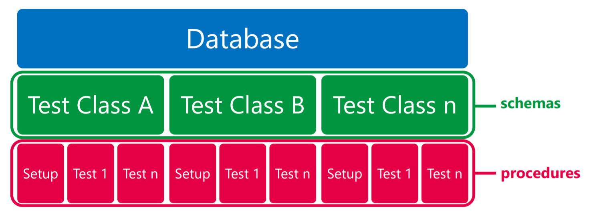

# Adventure Works Cycles - Production

## tSQLt testy

Adventure Works Cycles je fiktivním nadnárodním výrobcem jízdních kol a cyklistické příslušenství.

K dispozici máme databáze AdventureWorks2019 a AdventureWorksDW2019, a Power BI report DQaaS Lab, který používá CEO, šéf oddělení produkce a developerský tým

Protože datový proces musí fungovat správně, QA oddělení zjistilo od stakeholderů, jaké procesy jsou nejvíce klíčové.

V tomto dokumentu jsou sepsány požadavky, na základě kterých mají testeři napsat technické testy pomocí tSQLt frameworku.

Odkaz na oficiální stránky tSQLt frameworku: [tsqlt.org](https://tsqlt.org/)

### Struktura tSQLt testu:

tSQLt testy jsou exekuovány v rámci vámi zvolené databáze.  
TestClass představuje databázové schéma, samotný test je uložená procedura.

 

V části A je popis testů, které kontrolují existenci klíčových tabulek, v části B najdete Scenario testy.

## A) Testování existence objektů v Databázi

| Testovací požadavek | Název TestClass v databázi AdventureWorks2019 | Název Testu v databázi AdventureWorks2019 |
|---|---|---|
|Kontrola, že v databázi existují následující tabulky ve schématu Production:  BillOfMaterials,  Culture,  Document,  Illustration,  Location,  Product,  ProductCategory,  ProductCostHistor,  ProductDescription,  ProductDocument,  ProductInventory,  ProductListPriceHistory,  ProductModel,  ProductModelIllustration,  ProductModelProductDescriptionCulture,  ProductPhoto,  ProductProductPhoto,  ProductReview,  ProductSubcategory,  ScrapReason,  TransactionHistory,  TransactionHistoryArchive,  UnitMeasure,  WorkOrder,  WorkOrderRouting | [Test_Tables_Existence] | [test 01 Existence of production tables] |
 

## B) Testování procedur

| Testovací požadavek | Název TestClass v databázi AdventureWorks2019 | Název Testu v databázi AdventureWorks2019 | Testovaná procedura |
|---|---|---|---|
|Po spuštění procedury [Production].[CreateWorkOrder] se do tabulek WorkOrder a WorkOrderRouting vloží právě 1 řádek                                                       | Test_WorkOrderRouting_Fake                  | test 01 InsertWorkOrder                  | Production.CreateWorkOrder|
|Po jednom spuštění procedury [Production].[MoveWorkOrder] je do tabulky WorkOrderRouting vložen nový řádek a hodnoty nejsou NULL                                           | Test_WorkOrderRouting_Fake                  | test 02 UpdateWorkOrderRouting           | Production.MoveWorkOrder|
|Po spuštění procedury [Production].[FinishWorkOrder] je do tabulky WorkOrderRouting vložen nový řádek s hodnotami OperationSequence = 7 a LocationID = 60             | Test_WorkOrderRouting_Fake                  | test 04 CloseWorkOrder                   | Production.FinishWorkOrder |

 

> Úkol:

| Testovací požadavek | Název TestClass v databázi AdventureWorks2019 | Název Testu v databázi AdventureWorks2019 | Testovaná procedura |
|---|---|---|---|
|Otestujte proceduru [Production].[CreateWorkOrder] nahrazením hodnot v hranatých závorkách v testu [test 05 InsertWorkOrder NahradteVasimJmenem] vašimi hodnotami | Test_WorkOrderRouting_Fake | test 05 InsertWorkOrder NahradteVasimJmenem   | Production.CreateWorkOrder|
 

