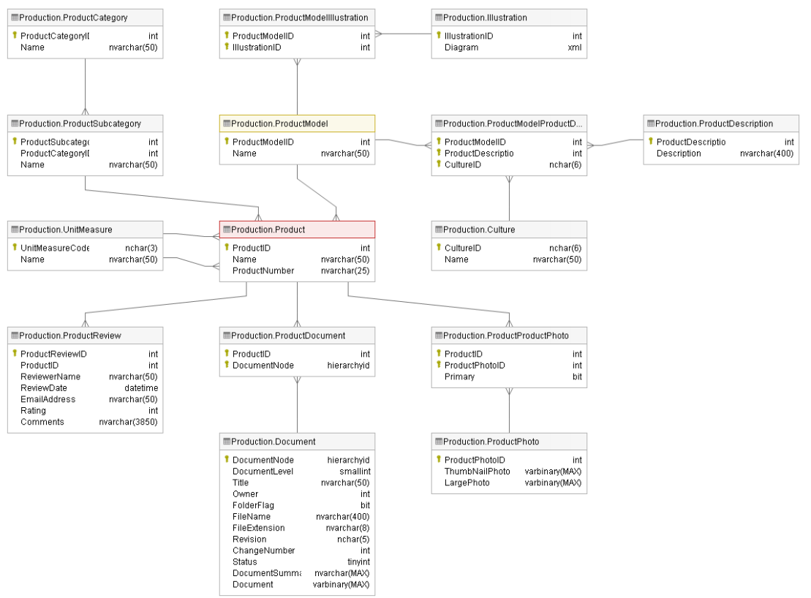

# Adventure Works Cycles - Production

## JC.Unit testy

V případě JC.Unit testů pracujeme s databázemi AdventureWorks2019 a AdventureWorksDW2019, které shromažďují data o fiktivním nadnárodním výrobci jízdních kol Adventure Works Cycles, a s Power BI reportem DQaaS Lab, který používá CEO, šéf oddělení produkce a developerský tým.

Data je potřeba kontrolovat, protože jsou na jejich základě tvořena důležitá byznysová rozhodnutí. Klíčoví stakeholdeři a šéfové oddělení produkce sepsali pro QA základní požadavky, které data musí splňovat.

## Struktura Smoke testu v souboru TestDefinitions.yaml

**TestSuite:** Název sady několika test cases, může být jakýkoli, například pod TestSuite zahrneme všechny Smoke testy.  
**Order:** Pořadí testu.  
**TestCase:** Název sady několika testů, může být jakýkoli, například název tabulky, pro kterou budeme tvořit více samostatných testů.  
**TestName:** Název pro test, může být jakýkoli, ale měli bychom z něj poznat, o co nám v testu jde. Z TestSuite, Order, TestCase a TestName JC.Unit složí celý název testu, takže bude vypadat například takto *[Smoke Sales].[1].[Sales.CreditCard].[Len of Card Number]*.  
**TestDescription:** Krátký popis testu - všem by pak mělo být jasné, o co v testu jde, pokud bude zkoumat bug.  
**TestQuerySource:** Název (alias) databáze nebo jiného zdroje, ve kterém bude exekuována query. Jedná se o ConnectionName, které jsme si definovali.  
**TestQuery:** Samotná query/dotaz do databáze nebo jiného zdroje.  
**TestTypeName:** Pro Smoke testy v tomto případě používáme **ZeroRows**. U ZeroRows JC.Unit očekává, že se nám nevrátí žádné hodnoty po exekuci query/dotazu. Pokud se nějaká hodnota vrátí, test spadne.

## Struktura Integračního testu v souboru TestDefinitions.yaml

**TestSuite:** Název sady několika test cases, může být jakýkoli, například pod TestSuite zahrneme všechny Integrační testy.  
**Order:** Pořadí testu.  
**TestCase:** Název sady několika testů, může být jakýkoli, například názvy tabulek, pro které budeme tvořit více samostatných testů.  
**TestName:** Název pro test, může být jakýkoli, ale měli bychom z něj poznat, o co nám v testu jde. Z TestSuite, Order, TestCase a TestName JC.Unit složí celý název testu, takže bude vypadat například takto *[Integration Sales].[1].[Sales.SalesTerritory x dbo.DimSalesTerritory].[Values of SalesTerritoryRegion]*.  
**TestDescription:** Krátký popis testu - všem by pak mělo být jasné, o co v testu jde, pokud bude zkoumat bug.  
**TestQuerySource:** Název (alias) databáze nebo jiného zdroje, ve kterém bude exekuována první query. Jedná se o ConnectionName, které jsme si definovali.  
**TestQuery:** Samotná query/dotaz do databáze nebo jiného zdroje.  
**ReferenceQuerySource:** Název (alias) databáze nebo jiného zdroje, ve kterém bude exekuována druhá referenční query. Jedná se o ConnectionName, které jsme si definovali.  
**ReferenceQuery:** Samotná query/dotaz do databáze nebo jiného zdroje.  
**TestTypeName:** Pro Integrační testy v tomto případě používáme **SameData**. U SameData JC:Unit očekává, že se nám z obou query/dotazů vrátí stejné hodnoty. Pokud hodnoty nejsou stejné, test spadne. Záleží na pořadí hodnot, proto používáme Order by.

V části A jsou sepsány požadavky na Smoke testy, v části B jsou požadavky na integrační testy pro tabulky v databázi AdventureWorks2019 a tabulky v databázi AdventureWorksDW2019. V části C je End to end test.

Na konci dokumentu můžete najít informace o tabulkách v
AdventureWorks2019.

## A)  Smoke testy

| Testovací požadavek | Název tabulky v databázi AdventureWorks2019 | Query |
| --- | --- | --- |
| Hodnoty ve sloupci SafetyStockLevel nesmí obsahovat hodnotu 0 nebo NULL | [Production].[Product] | SELECT SafetyStockLevel FROM [Production].[Product]  WHERE SafetyStockLevel = 0 OR SafetyStockLevel IS NULL |
| Hodnota ve sloupci StandardCost nesmí být větší než hodnota ve sloupci ListPrice | [Production].[Product] | SELECT StandardCost, ListPrice FROM [Production].[Product]  WHERE StandardCost > ListPrice |
| Datum ve sloupci SellStartDate nesmí být starší než 1.1.2000|[Production].[Product]|SELECT SellStartDate FROM [Production].[Product]  WHERE SellStartDate < 2000-01-01 |

 

> Úkol: Tento Smoke test doplňte do souboru TestDefinitionsWorkshop.yaml:

| Testovací požadavek | Název tabulky v databázi AdventureWorks2019 | Query |
| --- | --- | --- |
| Hodnota ve sloupci TransactionType musí obsahovat pouze hodnoty W, S nebo P|[Production].[TransactionHistory] | SELECT DISTINCT TransactionType FROM [Production].[TransactionHistory]  WHERE TransactionType NOT IN ('W','S','P') |

## B)  Integrační testy

| Testovací požadavek | Tabulka v AdventureWorks2019 | Tabulka v AdventureWorksDW2019 | Query AdventureWorks2019 | Query AdventureWorksDW2019 |
|---|---|---|---|---|
| Hodnoty Name v tabulce Product musí být stejné jako v tabulce DimProduct | [Production].[Product] | [dbo].[DimProduct] | SELECT Name FROM [Production].[Product]  ORDER BY Name | SELECT DISTINCT EnglishProductName FROM [dbo].[DimProduct]  ORDER BY EnglishProductName |
| Každý produkt z tabulky DimProduct musí mít záznam v tabulce FactProductInventory| - | 1. [dbo].[DimProduct],   2. [dbo].[FactProductInventory] | - | 1. SELECT COUNT(DISTINCT ProductKey) DistinctProductKey FROM [dbo].[DimProduct]   2. SELECT COUNT(DISTINCT ProductKey) DistinctProductKey FROM [dbo].[FactProductInventory] |

 

> Úkol: Tento Integrační test doplňte do souboru TestDefinitionsWorkshop.yaml:

| Testovací požadavek | Tabulka v AdventureWorks2019 | Tabulka v AdventureWorksDW2019 | Query AdventureWorks2019 | Query AdventureWorksDW2019 |
|---|---|---|---|---|
| Celková suma za každý produkt v tabulce SalesOrderHeader se musí rovnat celkové sumě v tabulce FactInternetSales | [Sales].[SalesOrderHeader] | [dbo].[FactInternetSales] | SELECT P.Name, SUM(D.LineTotal) AS SumLineTotal   FROM [Sales].[SalesOrderHeader] H   JOIN Sales.SalesOrderDetail D ON D.SalesOrderID = H.SalesOrderID  JOIN Production.Product P ON P.ProductID = D.ProductID  WHERE H.OnlineOrderFlag = 1  GROUP BY P.Name  ORDER BY P.Name; |SELECT P.EnglishProductName, SUM(S.SalesAmount) AS SumSalesAmount  FROM [dbo].[FactInternetSales] S  JOIN dbo.DimProduct P ON P.ProductKey = S.ProductKey  GROUP BY P.EnglishProductName  ORDER BY P.EnglishProductName; |

## C)  End to End test

| Testovací požadavek | Tabulka v AdventureWorks2019 | Tabulka v PowerBI reportu | Query AdventureWorks2019 | Query AdventureWorksDW2019 |
|---|---|---|---|---|
| Názvy produktů musí být stejné v databázi AdwentureWorks2019 a v DQaaS Lab Reportu | [Production].[Product] | ProductAlternateKey | SELECT COUNT (DISTINCT ProductNumber) FROM [Production].[Product] | EVALUATE ROW("Count", DISTINCTCOUNT('DimProduct'[ProductAlternateKey])) |

 

### Přehled tabulek za oddělení Production v databázi AdventureWorks2019
  |Název tabulky | Stručný popis |
  |---|---|
  |Production.Culture                                 |Lookup table containing the languages in which some AdventureWorks data is stored.
  |Production.Document                                |Product maintenance documents.
  |Production.Illustration                            |Bicycle assembly diagrams
  |Production.Product                                 |Products sold or used in the manufacturing of sold products.
  |Production.ProductCategory                         |High-level product categorization.
  |Production.ProductDescription                      |Product descriptions in several languages.
  |Production.ProductDocument                         |Cross-reference table mapping products to related product documents.
  |Production.ProductModel                            |Product model classification.
  |Production.ProductModelIllustration                |Cross-reference table mapping product models and illustrations.
  |Production.ProductModelProductDescriptionCulture   |Cross-reference table mapping product descriptions and the language the description is written in.
  |Production.ProductPhoto                            |Product images.
  |Production.ProductProductPhoto                     |Cross-reference table mapping products and product photos.
  |Production.ProductReview                           |Customer reviews of products they have purchased.
  |Production.ProductSubcategory                      |Product subcategories. See ProductCategory table.
  |Production.UnitMeasure                             |Unit of measure lookup table.

 

### Schéma tabulek v databázi AdventureWorks2019

